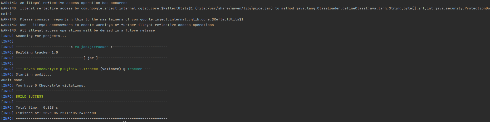
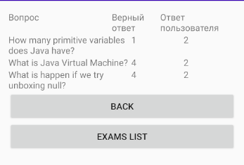

# Проект в рамках курса Job4j по мобильной разработке

## Цель. 
Освоение современных методов разработки мобильных приложений на базе Android Studio

## Сборка приложения
Информация будет добавляться по мере продвижения по проекту.

Окно вопросов в экзамене

Окно результатов экзамена

## Контакты
* my@e-mail.com
* [VK](https://vk.com/)
